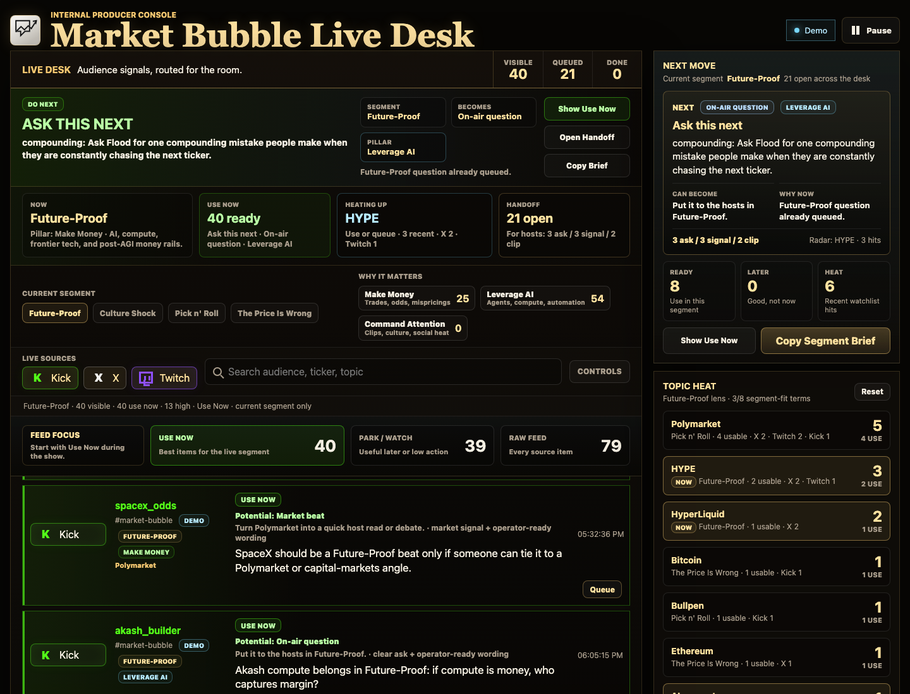

# Market Bubble Live Desk

Internal live production desk for Market Bubble: one real-time feed across Twitch, X, and Kick, with source labels and a producer queue for questions, market signals, and clip candidates.

Market Bubble is built around prediction-market discourse: digital culture, sports, crypto, tech, attention, and speculation. This desk is meant for the room during live recording, not as a generic chat toy.

For the simplest business pitch, see [PRODUCT_BRIEF.md](PRODUCT_BRIEF.md). For a short recording script, see [LOOM_SCRIPT.md](LOOM_SCRIPT.md).



## Plain-English Version

During a live show, useful audience signals are scattered everywhere.

This desk pulls them into one place and tells the operator what to do:

- `Use Now`: bring this to the hosts in the current segment.
- `Watch`: keep an eye on it.
- `Park`: useful, but save it for another segment.
- `Noise`: low-information chatter.

The point is not to read every message. The point is to turn a messy live feed into a short, useful rundown.

The desk now centers the feed around three Market Bubble pillars:

- `Make Money`: trades, odds, mispricings, position reads, and market calls.
- `Leverage AI`: agents, compute, automation, infrastructure, and AI-native edge.
- `Command Attention`: clips, culture, guest moments, timeline heat, and social reach.

## What It Does

- Combines Twitch, Kick, and X into one live feed.
- Labels where every message came from.
- Tags each message by Market Bubble segment.
- Tags each message by strategic pillar: `Make Money`, `Leverage AI`, or `Command Attention`.
- Marks each message as `Use Now`, `Watch`, `Park`, or `Noise`.
- Detects questions, market signals, clip candidates, culture chatter, and normal chat.
- Gives concrete, operator-ready messages priority over generic keyword hype.
- Suppresses repeated text so the feed does not get stuck on one recycled line.
- Lets the producer queue useful items for the hosts.
- Opens on `Use Now` for the current segment, so the operator starts with the useful feed instead of the raw firehose.
- Shows topic heat in `Topic Heat`.
- Gives a next best move at the top of the screen and in the `Next Move` panel.
- Creates copyable focus briefs and segment rundowns.
- Includes previous-show context and latest-show rehearsal mode for demos.
- Includes AWS Elastic Beanstalk deployment guidance for an always-live web version.

## Recent Product Fixes

These are the biggest improvements from the latest passes:

- The feed no longer relies only on raw keyword hits.
- Generic chatter like `HYPE just different` is treated as `Noise`.
- Useful asks like `Ask Ansem what invalidates this trade` become `Use Now`.
- Off-segment but useful messages become `Park`, so they are saved without distracting the current segment.
- The `Show Use Now` control focuses on actionable items for the current segment.
- `Topic Heat` ranks by usable items, not just mention count.
- `Next Move` can suggest an unqueued feed item directly.
- The new top strip tells the operator what to do next, what it can become, why it matters, and gives one-click actions for Use Now, host handoff, and copyable briefs.
- The default view is now `Use Now` plus the current segment, with `Raw Feed` one click away.
- `Why It Matters` lets the operator filter the feed and queue around the three show pillars.
- The demo feed is now show-aware and less repetitive.
- The repo includes `Procfile`, `.ebextensions`, `/healthz`, and AWS deployment docs.

## Local Run

```sh
npm install
npm run dev
```

Open `http://127.0.0.1:8899`.

`npm run dev` enables demo messages. For live mode:

```sh
DEMO_MODE=0 \
TWITCH_CHANNELS=marketbubble \
TWITCH_USERNAME=bot_login \
TWITCH_TOKEN=oauth:token \
KICK_CHANNELS=marketbubble \
X_BEARER_TOKEN=token \
X_RULES='marketbubble OR "Market Bubble" OR polymarket OR Bullpen OR Ansem OR Banks OR HYPE' \
npm start
```

Replace the Twitch/Kick channel names with the actual live channel slugs if they differ.

## Producer Flow

1. Open the desk before the show.
2. Set `Current Segment` to the live block.
3. Read the top `Do Next` strip first.
4. Use `Feed Focus`:
   - `Use Now` for items worth acting on in this segment.
   - `Park / Watch` for useful later items or low-action items.
   - `Raw Feed` when the operator needs the full source stream.
5. Queue the best item as `Ask`, `Signal`, or `Clip`.
6. Use `Topic Heat` when a topic starts building.
7. Copy a `Focus Brief` or `Segment Brief` when the hosts need a clean handoff.
8. Copy the `Rundown` at the end of a segment.
9. Mark used items `Done`.

For demos, open `Latest show rehearsal` and click `Run Rehearsal`.

## Deployment

This is a Node HTTP server with long-lived outbound connections and Server-Sent Events, so deploy it as a web service, not as static hosting.

Best first fit:

- AWS Elastic Beanstalk Node.js web server environment

Also workable later:

- AWS ECS/Fargate container service
- EC2/VPS with Node managed by a process manager

See [DEPLOYMENT.md](DEPLOYMENT.md).

## Environment

| Variable | Purpose |
| --- | --- |
| `PORT` | Local HTTP port. Defaults to `8899`. |
| `HOST` | Bind host. Defaults to `0.0.0.0` for cloud deploys. |
| `TEXT_REPEAT_SUPPRESS_MS` | Suppresses exact repeated feed text for this many milliseconds. Defaults to `120000`. |
| `DEMO_MODE` | `1` emits episode-aware sample Kick/X/Twitch messages. |
| `WORKSPACE_NAME` | Header title. Defaults to `Market Bubble Live Desk`. |
| `WORKSPACE_CONTEXT` | Comma-separated context chips. |
| `WORKSPACE_WATCHLIST` | Comma-separated watchlist chips. |
| `TWITCH_CHANNELS` | Comma-separated Twitch channel names. |
| `TWITCH_USERNAME` | Twitch bot/login name. |
| `TWITCH_TOKEN` | Twitch user access token with `chat:read`. |
| `KICK_CHANNELS` | Comma-separated Kick channel slugs. |
| `KICK_PUSHER_KEY` | Kick Pusher key override. |
| `KICK_PUSHER_CLUSTER` | Kick Pusher cluster override. Defaults to `us2`. |
| `X_BEARER_TOKEN` | X API bearer token. |
| `X_RULES` | Comma-separated X filtered stream rules. `tag=rule` is supported. |

## Source Notes

Twitch uses IRC over WebSocket at `wss://irc-ws.chat.twitch.tv:443`, requests tags/commands, replies to `PING`, and parses `PRIVMSG`.

X uses the v2 filtered stream endpoint. If `X_RULES` is provided, missing rules are added without deleting existing rules.

Kick uses its public Pusher chat transport as a best-effort live reader. If Kick changes its public Pusher app key or payload shape, set `KICK_PUSHER_KEY`/`KICK_PUSHER_CLUSTER` or update `normalizeKickPayload` in `server.js`.
